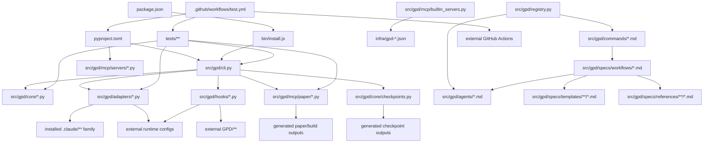

# Tests

This directory contains GPD's automated tests: core CLI and state regressions, runtime adapter coverage, hooks and MCP checks, release contracts, and fixture-based parity tests.

The repository graph below is checked in because graph guardrail tests read it directly.

Default `uv run pytest` runs the full checked-in suite, and `uv run pytest -q` does the same with quieter output. Both inherit `-n auto --dist=worksteal` from `pyproject.toml`. For local full-suite runs, `tests/conftest.py` raises xdist auto-worker selection toward the current CI shard fanout without changing collection. For serial debugging, override that default explicitly with `uv run pytest -n 0`.

The 180 second full-suite shard budget is enforced per CI pytest shard; the 10 minute job timeout remains the outer failure boundary. Shard target resolution has its own 3 minute timeout and logs elapsed seconds before pytest starts, git inventory calls have a 30 second timeout, and each collect-only subprocess has a 150 second timeout. Shard target resolution collects only the requested category. In-process repeated resolutions reuse the same immutable collection result, while CI matrix jobs stay isolated and do not share collection state across jobs. For a focused smoke pass, run `uv run pytest -n 0 tests/test_runtime_abstraction_boundaries.py tests/core/test_contract_schema_prompt_parity.py tests/core/test_review_contract_prompt_visibility.py tests/mcp/test_tool_contract_visibility.py tests/core/test_verifier_prompt_contract_visibility.py tests/core/test_verification_surface_alignment_regressions.py -q`.

The GitHub Actions workflow runs that same full suite as category-named runtime-informed shards: `root 1/9` through `root 9/9`, `adapters 1/2` through `adapters 2/2`, `hooks 1/2` through `hooks 2/2`, `mcp 1/2` through `mcp 2/2`, and `core 1/5` through `core 5/5`. `tests/ci_sharding.py` weights files by collected test counts, boosts root modules that have been slow on GitHub Actions, splits known hotspot modules such as `tests/test_runtime_cli.py`, `tests/test_registry.py`, `tests/test_update_workflow.py`, `tests/hooks/test_runtime_detect.py`, and `tests/mcp/test_verification_contract_server_regressions.py`, and greedily rebalances those work units inside each category while pytest keeps the default work-stealing parallelism policy.

## Repository Interdependency Graph

<!-- repo-graph-generated-on:start -->
Only marked repo-graph blocks are generated from the current worktree via `uv run python scripts/sync_repo_graph_contract.py`.
<!-- repo-graph-generated-on:end -->

## Status

This file is the repo's static dependency map plus its known blind spots.

It covers:

- canonical in-repo source edges
- installed and materialized artifact edges
- generated-output nodes used by build and test contracts
- external package, binary, service, and CI action nodes where they are operationally authoritative
- conditional and candidate-set edges where the code does not resolve to a single fixed file

## Scope

<!-- repo-graph-scope:start -->

- `src/gpd/commands/*.md`: `71`
- `src/gpd/agents/*.md`: `20`
- `src/gpd/specs/workflows/*.md`: `72`
- `src/gpd/specs/templates/**/*.md`: `81`
- `src/gpd/specs/references/**/*.md`: `250`
- `src/gpd/adapters/*.py`: `16`
- `src/gpd/hooks/*.py`: `11`
- `src/gpd/mcp/*.py`: `6`
- `src/gpd/mcp/integrations/*.py`: `2`
- `src/gpd/mcp/servers/*.py`: `15`
- `infra/gpd-*.json`: `8`

Excluded as noise from node counting, but still modeled where contractually relevant:

- `.git/**`
- `.mcp.json`
- `.npm-cache/**`
- `.playwright-mcp/**`
- `__pycache__/**`
- `.venv/**`
- `.pytest_cache/**`
- `.mypy_cache/**`
- `.ruff_cache/**`
- `GPD/**`
- `.claude/**`
- `.gemini/**`
- `.codex/**`
- `.opencode/**`
- `.copilot/**`
- `dist/**`
<!-- repo-graph-scope:end -->

Prompt stem inventory:

<!-- repo-graph-prompt-stem-inventory:start -->
- Same-stem command/workflow prompt stems: `69`
- Command-only prompt stems: `health`, `suggest-next`
- Workflow-only prompt stems: `execute-plan`, `transition`, `verify-phase`
<!-- repo-graph-prompt-stem-inventory:end -->

Generated-output families are modeled when code or tests depend on them:

- `dist/*.whl`
- `dist/*.tar.gz`
- `<workspace>/GPD/**`
- runtime config files and caches
- paper build outputs such as `{topic_specific_stem}.pdf`, `ARTIFACT-MANIFEST.json`, `BIBLIOGRAPHY-AUDIT.json`

## Edge Taxonomy

| Edge Type | Meaning |
| --- | --- |
| `hard-import` | Normal Python import or direct module dependency |
| `package-data-load` | Runtime file loaded from package data, often via `importlib.resources` |
| `authority` | Canonical source-of-truth relation, such as packaging metadata or descriptor builder |
| `materialized` | Install-time copied or rewritten output |
| `partial-ownership` | File or tree is selectively managed, not wholly owned |
| `config-mutation` | Only specific config keys/sections are added, updated, or removed |
| `semantic` | Policy or behavioral dependency expressed in docs/config rather than code import form |
| `spawn` | One unit launches another unit or subprocess |
| `conditional-spawn` | Spawn active only under a branch, severity gate, optional mode, or detected gap |
| `include` | Explicit markdown include or prompt include |
| `conditional-include` | Include/reference active only under a branch, severity gate, or selector |
| `selector-input` | Config, state, flags, or mode classification that gates other edges |
| `candidate-set` | Ordered family of possible paths rather than one fixed path |
| `external-package` | Python package dependency |
| `external-binary` | System binary dependency |
| `external-service` | Network endpoint or remote authority |
| `generated-output` | Build/test/runtime generated artifact |
| `manifest-contract` | Test or runtime contract over manifest structure, hashes, or tracked cleanup |
| `negative-packaging-contract` | Contract that a file/dependency must be excluded from shipped artifacts |
| `count-contract` | Contract over counts, field cardinality, registry totals, or inventory shape |
| `ordering-contract` | Contract that depends on a specific ordering or precedence rule |
| `schema-contains` | Schema/model contains another schema/model as a typed field |
| `schema-canonicalizes` | Schema is used to normalize persisted data before writing |
| `schema-derived-constant` | Constants or field lists derived from schema structure |
| `entity-id-ref` | Object graph linked by IDs inside serialized data |
| `decorator-wrap` | Runtime behavior changed via decorator application |
| `span-context` | Runtime behavior instrumented through direct span context blocks |
| `golden-fixture-contract` | Tests depend on curated fixture corpora as canonical truth tables |
| `typed-roundtrip` | Tests or runtime paths validate typed serialize/deserialize normalization |
| `mention` | Weak text/path mention; low confidence compared with operational edges |

## High-Level Graph

## Required Edge Contracts

<!-- repo-graph-required-edges:start -->
- `.github/workflows/test.yml -> tests/ci_sharding.py`
  `authority`
- `.github/workflows/test.yml -> actions/checkout@v6`
  `external-service`
- `.github/workflows/test.yml -> actions/setup-node@v6`
  `external-service`
- `src/gpd/mcp/builtin_servers.py -> src/gpd/mcp/descriptor_text.py`
  `hard-import`
- `src/gpd/mcp/servers/skills_server.py -> src/gpd/mcp/descriptor_text.py`
  `hard-import`
- `pyproject.toml -> src/gpd/mcp/servers/{arxiv_bridge,conventions_server,verification_server,protocols_server,errors_mcp,patterns_server,state_server,skills_server}.py`
  `authority`
- `pyproject.toml -> src/gpd/mcp/integrations/wolfram_bridge.py`
  `authority`
- `src/gpd/hooks/statusline.py -> src/gpd/hooks/runtime_detect.py`
  `hard-import`
- `src/gpd/hooks/statusline.py -> src/gpd/adapters/__init__.py`
  `hard-import`
- `src/gpd/hooks/check_update.py -> src/gpd/hooks/runtime_detect.py`
  `hard-import`
- `src/gpd/hooks/notify.py -> src/gpd/hooks/check_update.py`
  `spawn`
- `src/gpd/hooks/notify.py -> src/gpd/hooks/runtime_detect.py`
  `hard-import`
- `src/gpd/cli.py::sync_phase_checkpoints -> src/gpd/core/checkpoints.py::sync_phase_checkpoints`
  `spawn`
- `src/gpd/core/phases.py -> src/gpd/core/checkpoints.py::sync_phase_checkpoints`
  `hard-import`
- `src/gpd/core/state.py -> <cwd>/GPD/.state-write-intent`
  `generated-output`
- `src/gpd/core/checkpoints.py -> generated outputs {GPD/CHECKPOINTS.md, GPD/phase-checkpoints/*.md}`
  `generated-output`
- `src/gpd/core/checkpoints.py -> <cwd>/GPD/CHECKPOINTS.md`
  `generated-output`
- `src/gpd/core/checkpoints.py -> <cwd>/GPD/phase-checkpoints/*.md`
  `generated-output`
- `src/gpd/specs/workflows/execute-phase.md -> src/gpd/specs/{references/orchestration/meta-orchestration.md,references/orchestration/artifact-surfacing.md,references/orchestration/checkpoints.md,references/verification/core/verification-core.md,templates/summary.md,templates/continuation-prompt.md,templates/paper/figure-tracker.md,templates/paper/experimental-comparison.md,templates/recovery-plan.md}`
  `include`
- `src/gpd/specs/workflows/execute-phase.md -> src/gpd/specs/{references/orchestration/meta-orchestration.md,references/orchestration/checkpoints.md,references/orchestration/continuous-execution.md,references/verification/core/verification-core.md,templates/summary.md,templates/continuation-prompt.md,templates/paper/figure-tracker.md,templates/paper/experimental-comparison.md,templates/recovery-plan.md}`
  `include`
- `src/gpd/specs/workflows/execute-plan.md -> src/gpd/specs/{references/execution/git-integration.md,references/execution/github-lifecycle.md,references/execution/execute-plan-recovery.md,references/execution/execute-plan-validation.md,references/execution/execute-plan-checkpoints.md,references/protocols/reproducibility.md,references/execution/executor-index.md,references/orchestration/context-budget.md,references/orchestration/checkpoints.md,templates/summary.md}`
  `include`
- `src/gpd/specs/workflows/plan-phase.md -> src/gpd/specs/templates/plan-contract-schema.md`
  `include`
- `src/gpd/specs/workflows/execute-plan.md -> src/gpd/specs/templates/contract-results-schema.md`
  `include`
- `src/gpd/specs/workflows/verify-work.md -> src/gpd/specs/templates/contract-results-schema.md`
  `include`
- `src/gpd/specs/workflows/verify-work.md -> src/gpd/specs/templates/plan-contract-schema.md`
  `include`
- `src/gpd/specs/workflows/write-paper.md -> src/gpd/specs/templates/paper/{paper-config-schema.md,artifact-manifest-schema.md,bibliography-audit-schema.md,reproducibility-manifest.md}`
  `include`
- `src/gpd/specs/workflows/new-project.md -> src/gpd/specs/templates/project-contract-schema.md`
  `include`
- `src/gpd/commands/peer-review.md -> src/gpd/agents/{gpd-review-reader,gpd-review-literature,gpd-review-math,gpd-check-proof,gpd-review-physics,gpd-review-significance,gpd-referee}.md`
  `spawn`
- `src/gpd/specs/workflows/peer-review.md -> src/gpd/agents/{gpd-review-reader,gpd-review-literature,gpd-review-math,gpd-check-proof,gpd-review-physics,gpd-review-significance,gpd-referee}.md`
  `spawn`
- `src/gpd/agents/{gpd-review-reader,gpd-review-literature,gpd-review-math,gpd-check-proof,gpd-review-physics,gpd-review-significance,gpd-referee}.md -> src/gpd/specs/references/publication/peer-review-panel.md`
  `include`
<!-- repo-graph-required-edges:end -->

## Canonical Authority Chains

- `package.json -> bin/install.js`
  `authority`
  npm/bootstrap surface; `bin/install.js` reads the npm wrapper version, the pinned Python package version, and repository metadata.

- `bin/install.js -> package.json`
  `package-data-load`

- `bin/install.js -> src/gpd/adapters/runtime_catalog.json`
  `package-data-load`
  Bootstrap runtime selection and CLI help text are driven by the shared runtime catalog shipped in the npm tarball.

- `bin/install.js -> src/gpd/cli.py`
  `spawn`
  The Node installer ultimately hands off to `python -m gpd.cli {install,uninstall} ...`.

- `bin/install.js -> external Python package {get-physics-done}`
  `external-package`

- `bin/install.js -> GitHub tagged release source family {https://github.com/psi-oss/get-physics-done/archive/refs/tags/v<version>.tar.gz, git+https://github.com/psi-oss/get-physics-done.git@v<version>}`
  `external-service`

- `bin/install.js -> GitHub main-branch source family {https://github.com/psi-oss/get-physics-done/archive/refs/heads/main.tar.gz, git+https://github.com/psi-oss/get-physics-done.git@main}`
  `external-service`

- `bin/install.js -> release install candidate chain {PyPI package, tag archive, https tag checkout}`
  `ordering-contract`
  Normal install and `--reinstall` use the pinned PyPI release first, then matching tagged GitHub release sources as fallback, and fail closed if neither can be installed.

- `bin/install.js -> main-branch upgrade candidate chain {main archive, https main checkout}`
  `ordering-contract`
  `--upgrade` prefers the latest `main` branch source and fails closed if no main-branch source can be installed.

- `bin/install.js -> external binaries {node, python3, python, git}`
  `external-binary`

- `bin/install.js -> ${GPD_HOME:-~/.gpd}/venv/**`
  `generated-output`

- `pyproject.toml -> src/gpd/cli.py`
  `authority`
  Python console-script authority for `gpd`.

- `pyproject.toml -> src/gpd/mcp/servers/{arxiv_bridge,conventions_server,verification_server,protocols_server,errors_mcp,patterns_server,state_server,skills_server}.py`
  `authority`
  Console-script authority for shipped `gpd-mcp-*` server entrypoints.

- `pyproject.toml -> src/gpd/mcp/integrations/wolfram_bridge.py`
  `authority`
  Console-script authority for the shipped `gpd-mcp-wolfram` integration entrypoint.

- `src/gpd/version.py -> pyproject.toml`
  `authority`
  Fallback version source when installed metadata is unavailable.

- `pyproject.toml -> external Python packages {typer, rich, pydantic, PyYAML, mcp, pybtex, Pillow, jinja2, pytest, pytest-asyncio, pytest-xdist, ruff, hatchling, arxiv, httpx, pymupdf4llm, cairosvg, pypdf}`
  `external-package`

- `src/gpd/mcp/builtin_servers.py -> infra/gpd-*.json`
  `authority`
  Canonical descriptor builder for committed MCP descriptors.

- `README.md -> CONTRIBUTING.md`
  `authority`
  Public docs split between user-facing and contributor-facing flows.

## Root, Build, Release, and Governance Surface

- `README.md -> .github/workflows/test.yml`
  `mention`
  CI badge link only; weaker than execution or packaging edges.

- `.github/workflows/test.yml -> tests/**`
  `authority`
  Runs the full checked-in pytest suite as category-named runtime-informed shards.

- `.github/workflows/test.yml -> tests/ci_sharding.py`
  `authority`
  Resolves live non-empty pytest shard targets from the current test inventory and owns the category shard counts plus hotspot split and weight metadata.

- `.github/workflows/test.yml -> pyproject.toml`
  `authority`
  The workflow uses project dependency metadata via `uv sync --dev`.

- `.github/workflows/test.yml -> uv.lock`
  `authority`
  Locked dependency resolution surface for CI.

- `.github/workflows/test.yml -> actions/checkout@v6`
  `external-service`

- `.github/workflows/test.yml -> actions/setup-python@v6`
  `external-service`

- `.github/workflows/test.yml -> actions/setup-node@v6`
  `external-service`

- `.github/workflows/test.yml -> astral-sh/setup-uv@v7`
  `external-service`

- `.github/pull_request_template.md -> src/**`
  `partial-ownership`
  PR policy requires source changes to carry tests and docs implications.

- `.github/pull_request_template.md -> tests/**`
  `partial-ownership`

- `.github/pull_request_template.md -> README.md`
  `partial-ownership`

- `.github/ISSUE_TEMPLATE/bug_report.yml -> src/gpd/cli.py`
  `semantic`
  Reporter is asked for `gpd --version`.

- `.github/ISSUE_TEMPLATE/bug_report.yml -> pyproject.toml`
  `semantic`
  Public package metadata and version surface.

- `.github/ISSUE_TEMPLATE/bug_report.yml -> src/gpd/version.py`
  `semantic`

- `.github/ISSUE_TEMPLATE/feature_request.yml -> src/gpd/cli.py`
  `semantic`

- `.github/ISSUE_TEMPLATE/feature_request.yml -> src/gpd/commands/**`
  `semantic`

- `CONTRIBUTING.md -> src/gpd/mcp/builtin_servers.py`
  `authority`
  Contributor docs explicitly require keeping descriptors in sync with the canonical builder.

- `CONTRIBUTING.md -> infra/gpd-*.json`
  `authority`

## CLI, Core Runtime, Schema, and Object Layers

- `src/gpd/cli.py -> src/gpd/core/*.py`
  `hard-import` plus `candidate-set`
  The CLI is a dynamic router over core modules and over on-disk project layout under `<cwd>/GPD/**`.

- `src/gpd/cli.py -> external project-layout family <cwd>/GPD/{state.json,STATE.md,config.json,phases/**,milestones/**,traces/**}`
  `candidate-set`

- `src/gpd/cli.py -> ordered paper-config candidate family {paper,manuscript,draft}/PAPER-CONFIG.json`
  `candidate-set`

- `src/gpd/cli.py -> ordered paper-config candidate family {paper,manuscript,draft}/PAPER-CONFIG.json`
  `ordering-contract`
  `_resolve_existing_input_path()` returns the first existing config from the declared candidate order.

- `src/gpd/cli.py -> active manuscript roots {paper,manuscript,draft} resolved via {ARTIFACT-MANIFEST.json, PAPER-CONFIG.json}`
  `candidate-set`

- `src/gpd/cli.py -> active manuscript roots {paper,manuscript,draft} resolved via {ARTIFACT-MANIFEST.json, PAPER-CONFIG.json}`
  `ordering-contract`

- `src/gpd/cli.py -> peer-review manuscript entrypoint resolver {target/ARTIFACT-MANIFEST.json, target/PAPER-CONFIG.json}`
  `candidate-set`

- `src/gpd/cli.py -> peer-review manuscript entrypoint resolver {target/ARTIFACT-MANIFEST.json, target/PAPER-CONFIG.json}`
  `ordering-contract`

- `src/gpd/cli.py -> bibliography candidate family {config_path.parent, output_dir, <cwd>/references}/{<bib_stem>.bib}`
  `candidate-set`

- `src/gpd/cli.py -> bibliography candidate family {config_path.parent, output_dir, <cwd>/references}/{<bib_stem>.bib}`
  `ordering-contract`

- `src/gpd/cli.py -> strict review artifact manifest candidates {manuscript.parent/ARTIFACT-MANIFEST.json}`
  `candidate-set`

- `src/gpd/cli.py -> strict review artifact manifest candidates {manuscript.parent/ARTIFACT-MANIFEST.json}`
  `ordering-contract`

- `src/gpd/cli.py -> strict review bibliography audit candidates {manuscript.parent/BIBLIOGRAPHY-AUDIT.json}`
  `candidate-set`

- `src/gpd/cli.py -> strict review bibliography audit candidates {manuscript.parent/BIBLIOGRAPHY-AUDIT.json}`
  `ordering-contract`

- `src/gpd/cli.py -> strict review reproducibility manifest candidates {manuscript.parent/reproducibility-manifest.json}`
  `candidate-set`

- `src/gpd/cli.py -> strict review reproducibility manifest candidates {manuscript.parent/reproducibility-manifest.json}`
  `ordering-contract`

- `src/gpd/cli.py -> src/gpd/core/patterns.py -> {GPD_PATTERNS_ROOT, GPD_DATA_DIR, ~/.gpd/learned-patterns}`
  `candidate-set`

- `src/gpd/cli.py -> effective observability roots <cwd>/GPD/observability/{sessions/*.jsonl,sessions/*.json,current-session.json,current-execution.json}`
  `candidate-set`

- `src/gpd/cli.py -> effective observability roots <cwd>/GPD/observability/{sessions/*.jsonl,sessions/*.json,current-session.json,current-execution.json}`
  `ordering-contract`
  Per-session event streams are authoritative; session metadata and current execution snapshots provide the latest pointers.

- `src/gpd/cli.py -> explicit --target-dir over adapter-derived local/global runtime roots during install/uninstall`
  `selector-input`
  Explicit target selection flips installed references from runtime-derived local/global paths to absolute target-root paths.

- `src/gpd/cli.py -> src/gpd/adapters/__init__.py`
  `hard-import`

- `src/gpd/cli.py -> src/gpd/mcp/paper/models.py`
  `hard-import`

- `src/gpd/cli.py -> src/gpd/mcp/paper/bibliography.py`
  `hard-import`

- `src/gpd/cli.py -> src/gpd/mcp/paper/compiler.py`
  `hard-import`

- `src/gpd/cli.py::sync_phase_checkpoints -> src/gpd/core/checkpoints.py::sync_phase_checkpoints`
  `spawn`

- `src/gpd/core/phases.py -> src/gpd/core/checkpoints.py::sync_phase_checkpoints`
  `spawn`
  `phases.py` also regenerates checkpoint artifacts after phase completion and cleanup.

- `src/gpd/core/checkpoints.py -> generated outputs {GPD/CHECKPOINTS.md, GPD/phase-checkpoints/*.md}`
  `generated-output`
  `sync-phase-checkpoints` materializes the internal checkpoint index plus one checkpoint note per phase directory.

- `src/gpd/core/state.py -> src/gpd/contracts.py`
  `schema-contains`
  `ResearchState` contains `ConventionLock` and related typed state structures.

- `src/gpd/core/state.py -> src/gpd/core/results.py`
  `schema-contains`
  `ResearchState.intermediate_results` contains `IntermediateResult | str`.

- `src/gpd/core/state.py -> state.json`
  `schema-canonicalizes`

- `src/gpd/core/state.py -> STATE.md`
  `schema-canonicalizes`

- `src/gpd/core/state.py -> state.json.bak`
  `generated-output`

- `src/gpd/core/state.py -> <cwd>/GPD/.state-write-intent`
  `generated-output`
  Dual-write recovery marker for interrupted `state.json` and `STATE.md` writes.

- `src/gpd/core/checkpoints.py -> <cwd>/GPD/CHECKPOINTS.md`
  `generated-output`

- `src/gpd/core/checkpoints.py -> <cwd>/GPD/phase-checkpoints/*.md`
  `generated-output`

- `src/gpd/core/results.py -> src/gpd/contracts.py`
  `schema-contains`
  `IntermediateResult` uses `VerificationEvidence`.

- `src/gpd/core/results.py -> src/gpd/core/results.py::{IntermediateResult, MissingDep}`
  `schema-contains`
  `ResultDeps.result/direct_deps/transitive_deps` contain typed result/dependency records.

- `src/gpd/core/results.py -> IntermediateResult.depends_on`
  `entity-id-ref`
  Internal result graph by ID, not by file path.

- `src/gpd/core/state.py -> src/gpd/core/results.py::IntermediateResult.id`
  `entity-id-ref`
  `state_validate()` resolves `depends_on[*]` as references to concrete result IDs.

- `src/gpd/core/conventions.py -> src/gpd/core/conventions.py::{ConventionEntry, ConventionDiff}`
  `schema-contains`
  Convention list/check/diff result models are nested typed structures, not flat dicts.

- `src/gpd/mcp/paper/models.py -> BibliographyAudit -> ArtifactManifest -> ArtifactRecord -> ArtifactSourceRef`
  `schema-contains`

- `src/gpd/mcp/paper/models.py -> src/gpd/mcp/paper/models.py::{Author, Section, FigureRef, ArtifactManifest}`
  `schema-contains`

- `src/gpd/mcp/paper/models.py -> src/gpd/mcp/paper/bibliography.py::BibliographyAudit`
  `schema-contains`

- `src/gpd/mcp/paper/models.py -> PaperOutput`
  `schema-canonicalizes`
  Paper-layer typed outputs normalize emitted manifest/audit structures.

- `src/gpd/contracts.py -> src/gpd/core/conventions.py`
  `schema-derived-constant`
  `ConventionLock.model_fields` drives known-convention lists and related counts.

- `src/gpd/contracts.py -> src/gpd/core/state.py`
  `schema-derived-constant`

- `src/gpd/contracts.py -> tests/test_metadata_consistency.py`
  `count-contract`

- `src/gpd/core/observability.py -> src/gpd/core/*.py`
  `decorator-wrap`
  Runtime behavior changed through decorator application.

- `src/gpd/core/observability.py -> src/gpd/core/state.py`
  `decorator-wrap`

- `src/gpd/core/observability.py -> src/gpd/core/results.py`
  `decorator-wrap`

- `src/gpd/core/observability.py -> src/gpd/core/conventions.py`
  `decorator-wrap`

- `src/gpd/core/observability.py -> src/gpd/core/phases.py`
  `span-context`

- `src/gpd/core/observability.py -> src/gpd/core/health.py`
  `span-context`

- `src/gpd/core/observability.py -> src/gpd/adapters/*.py`
  `span-context`

- `src/gpd/core/observability.py -> src/gpd/mcp/servers/*.py`
  `span-context`

- `src/gpd/core/observability.py -> <cwd>/GPD/observability/{sessions/*.jsonl,sessions/*.json,current-session.json,current-execution.json}`
  `generated-output`
  Observability writes and rereads per-session event streams, session metadata, and flat current-execution snapshots from this tree.

- `src/gpd/core/context.py -> import-time platform snapshot _PLATFORM`
  `selector-input`
  `init_*` context helpers reuse a cached platform classification chosen at module import.

- `src/gpd/core/context.py -> project scan envelope {lexicographic cwd walk, depth limit, capped hit count, excludes runtime config dirs and ignored trees}`
  `selector-input`
  New-project detection is gated by this scan envelope rather than by a raw recursive walk.

- `src/gpd/core/query.py -> dependency frontmatter precedence {nested dependency-graph.{provides,requires,affects} over top-level counterparts}`
  `ordering-contract`
  Query-time dependency semantics follow parser precedence, not simple field union.

- `src/gpd/core/query.py -> GPD/phases/**/{*-SUMMARY.md,SUMMARY.md}`
  `candidate-set`
  Query walks both plan-scoped `*-SUMMARY.md` files and standalone `SUMMARY.md` files under each phase directory.

## Registry, Commands, Agents, Workflows, Templates, and References

- `src/gpd/registry.py -> src/gpd/commands/*.md`
  `authority`
  Canonical parser for command prompt definitions.

- `src/gpd/registry.py -> src/gpd/agents/*.md`
  `authority`
  Canonical parser for agent prompt definitions.

<!-- repo-graph-same-stem-command-workflow:start -->
- `src/gpd/commands/{add-phase,add-todo,arxiv-submission,audit-milestone,autonomous,branch-hypothesis,check-todos,compact-state,compare-branches,compare-experiment,compare-results,complete-milestone,debug,decisions,derive-equation,digest-knowledge,dimensional-analysis,discover,discuss-phase,error-patterns,error-propagation,execute-phase,explain,export,export-logs,graph,help,insert-phase,limiting-cases,list-phase-assumptions,literature-review,map-research,merge-phases,new-milestone,new-project,numerical-convergence,parameter-sweep,pause-work,peer-review,plan-milestone-gaps,plan-phase,progress,quick,reapply-patches,record-backtrack,record-insight,regression-check,remove-phase,research-phase,respond-to-referees,resume-work,review-knowledge,revise-phase,route,sensitivity-analysis,set-profile,set-tier-models,settings,show-phase,slides,start,sync-state,tangent,tour,undo,update,validate-conventions,verify-work,write-paper}.md -> src/gpd/specs/workflows/{same stems}.md`
<!-- repo-graph-same-stem-command-workflow:end -->
  `include`
  Explicit same-stem command-to-workflow includes are node-level edges, not just an aggregate count.

- `src/gpd/commands/help.md -> runtime slash-command surface contract {in-runtime `/gpd:*` reference, local CLI distinction, `gpd --help`, `gpd validate command-context <name>`}`
  `behavior-contract`
  Help must say these entries describe the in-runtime slash-command surface, not promise that every item is a direct local `gpd` CLI subcommand.

- `src/gpd/commands/help.md -> src/gpd/core/commands.py::cmd_regression_check`
  `behavior-contract`
  `/gpd:regression-check` help must describe the implemented SUMMARY/VERIFICATION scan instead of claiming a full re-run of dimensional, limit, or numerical verification.

- `src/gpd/specs/workflows/help.md -> slash-command/local-CLI distinction and regression-check wording from src/gpd/commands/help.md`
  `parity`
  Command and workflow help surfaces should stay synchronized on invocation-surface semantics and on the actual `regression-check` behavior.

- `src/gpd/commands/explain.md -> src/gpd/agents/{gpd-explainer,gpd-bibliographer}.md`
  `spawn`

- `src/gpd/specs/workflows/literature-review.md -> src/gpd/agents/gpd-literature-reviewer.md`
  `spawn`

- `src/gpd/commands/debug.md -> src/gpd/agents/gpd-debugger.md`
  `spawn`

- `src/gpd/commands/map-research.md -> src/gpd/agents/gpd-research-mapper.md`
  `spawn`

- `src/gpd/commands/plan-phase.md -> src/gpd/agents/{gpd-planner,gpd-plan-checker}.md`
  `spawn`

- `src/gpd/commands/quick.md -> src/gpd/agents/{gpd-planner,gpd-executor}.md`
  `spawn`

- `src/gpd/commands/research-phase.md -> src/gpd/agents/gpd-phase-researcher.md`
  `spawn`

- `src/gpd/commands/write-paper.md -> src/gpd/agents/{gpd-paper-writer,gpd-bibliographer,gpd-review-reader,gpd-review-literature,gpd-review-math,gpd-review-physics,gpd-review-significance,gpd-referee}.md`
  `spawn`

- `src/gpd/commands/write-paper.md -> gpd paper-build paper/PAPER-CONFIG.json`
  `spawn`

- `src/gpd/commands/write-paper.md -> paper/{PAPER-CONFIG.json,<topic_stem>.tex,ARTIFACT-MANIFEST.json}`
  `generated-output`
  The command explicitly creates the paper config and requires the canonical manuscript scaffold before drafting continues.

- `src/gpd/commands/peer-review.md -> src/gpd/agents/{gpd-review-reader,gpd-review-literature,gpd-review-math,gpd-check-proof,gpd-review-physics,gpd-review-significance,gpd-referee}.md`
  `spawn`

- `src/gpd/commands/peer-review.md -> active manuscript roots {paper,manuscript,draft} resolved via {ARTIFACT-MANIFEST.json, PAPER-CONFIG.json}`
  `candidate-set`

- `src/gpd/commands/health.md -> GPD/{STATE.md,state.json,config.json}`
  `include`

- `src/gpd/commands/health.md -> gpd --raw health {,--fix}`
  `spawn`

- `src/gpd/commands/suggest-next.md -> GPD/{STATE.md,ROADMAP.md}`
  `include`

- `src/gpd/commands/suggest-next.md -> gpd --raw suggest`
  `spawn`

- `src/gpd/commands/new-project.md -> src/gpd/specs/workflows/new-project.md`
  `include`

- `src/gpd/commands/new-milestone.md -> src/gpd/specs/workflows/new-milestone.md`
  `include`

- `src/gpd/commands/new-milestone.md -> src/gpd/specs/references/research/questioning.md`
  `include`

- `src/gpd/commands/new-milestone.md -> src/gpd/specs/references/ui/ui-brand.md`
  `include`

- `src/gpd/commands/new-milestone.md -> src/gpd/specs/templates/project.md`
  `include`

- `src/gpd/commands/new-milestone.md -> src/gpd/specs/templates/requirements.md`
  `include`

- `src/gpd/commands/discuss-phase.md -> src/gpd/specs/templates/context.md`
  `include`

- `src/gpd/commands/complete-milestone.md -> src/gpd/specs/templates/milestone-archive.md`
  `include`

- `src/gpd/commands/execute-phase.md -> src/gpd/specs/references/ui/ui-brand.md`
  `include`

- `src/gpd/commands/plan-phase.md -> src/gpd/specs/references/ui/ui-brand.md`
  `include`

- `src/gpd/commands/research-phase.md -> src/gpd/specs/references/orchestration/model-profile-resolution.md`
  `include`

- `src/gpd/commands/verify-work.md -> src/gpd/specs/references/verification/core/verification-core.md`
  `include`

- `src/gpd/specs/workflows/plan-phase.md -> src/gpd/agents/gpd-phase-researcher.md`
  `conditional-spawn`

- `src/gpd/specs/workflows/plan-phase.md -> src/gpd/agents/gpd-planner.md`
  `spawn`

- `src/gpd/specs/workflows/plan-phase.md -> src/gpd/agents/gpd-plan-checker.md`
  `conditional-spawn`

- `src/gpd/specs/workflows/plan-phase.md -> src/gpd/agents/gpd-experiment-designer.md`
  `conditional-spawn`
  Only when numerical indicators or mode require it.

- `src/gpd/specs/workflows/plan-phase.md -> src/gpd/specs/templates/planner-subagent-prompt.md`
  `include`

- `src/gpd/specs/workflows/plan-phase.md -> src/gpd/specs/templates/phase-prompt.md`
  `include`

- `src/gpd/specs/workflows/plan-phase.md -> src/gpd/specs/templates/plan-contract-schema.md`
  `include`

- `src/gpd/specs/workflows/plan-phase.md -> src/gpd/specs/references/ui/ui-brand.md`
  `include`

- `src/gpd/specs/workflows/plan-phase.md -> src/gpd/specs/references/orchestration/context-budget.md`
  `include`

- `src/gpd/agents/gpd-planner.md -> src/gpd/specs/templates/planner-subagent-prompt.md`
  `include`

- `src/gpd/agents/{gpd-bibliographer,gpd-consistency-checker,gpd-debugger,gpd-executor,gpd-experiment-designer,gpd-literature-reviewer,gpd-notation-coordinator,gpd-paper-writer,gpd-phase-researcher,gpd-plan-checker,gpd-planner,gpd-project-researcher,gpd-referee,gpd-research-synthesizer,gpd-roadmapper,gpd-research-mapper,gpd-verifier}.md -> src/gpd/specs/references/shared/shared-protocols.md`
  `include`

- `src/gpd/agents/{gpd-review-reader,gpd-review-literature,gpd-review-math,gpd-check-proof,gpd-review-physics,gpd-review-significance}.md -> src/gpd/specs/references/shared/shared-protocols.md`
  `include`

- `src/gpd/agents/{gpd-bibliographer,gpd-consistency-checker,gpd-debugger,gpd-executor,gpd-experiment-designer,gpd-explainer,gpd-literature-reviewer,gpd-notation-coordinator,gpd-paper-writer,gpd-phase-researcher,gpd-plan-checker,gpd-planner,gpd-project-researcher,gpd-referee,gpd-research-synthesizer,gpd-roadmapper,gpd-research-mapper}.md -> src/gpd/specs/references/orchestration/agent-infrastructure.md`
  `include`

- `src/gpd/agents/{gpd-review-reader,gpd-review-literature,gpd-check-proof,gpd-review-significance}.md -> src/gpd/specs/references/orchestration/agent-infrastructure.md`
  `include`

- `src/gpd/agents/{gpd-bibliographer,gpd-consistency-checker,gpd-debugger,gpd-executor,gpd-explainer,gpd-phase-researcher,gpd-plan-checker,gpd-planner,gpd-referee,gpd-research-mapper,gpd-verifier}.md -> src/gpd/specs/references/physics-subfields.md`
  `include`

- `src/gpd/agents/{gpd-review-math,gpd-check-proof,gpd-review-physics}.md -> src/gpd/specs/references/physics-subfields.md`
  `include`

- `src/gpd/agents/{gpd-consistency-checker,gpd-debugger,gpd-plan-checker,gpd-planner,gpd-referee,gpd-verifier}.md -> src/gpd/specs/references/verification/core/verification-core.md`
  `include`

- `src/gpd/agents/{gpd-review-math,gpd-check-proof,gpd-review-physics}.md -> src/gpd/specs/references/verification/core/verification-core.md`
  `include`

- `src/gpd/agents/{gpd-bibliographer,gpd-paper-writer,gpd-referee}.md -> src/gpd/specs/references/publication/publication-pipeline-modes.md`
  `include`

- `src/gpd/agents/{gpd-review-literature,gpd-review-significance}.md -> src/gpd/specs/references/publication/publication-pipeline-modes.md`
  `include`

- `src/gpd/agents/{gpd-review-reader,gpd-review-literature,gpd-review-math,gpd-check-proof,gpd-review-physics,gpd-review-significance,gpd-referee}.md -> src/gpd/specs/references/publication/peer-review-panel.md`
  `include`

- `src/gpd/agents/{gpd-phase-researcher,gpd-project-researcher,gpd-verifier}.md -> src/gpd/specs/references/research/research-modes.md`
  `include`

- `src/gpd/agents/{gpd-consistency-checker,gpd-debugger,gpd-executor}.md -> src/gpd/specs/references/shared/cross-project-patterns.md`
  `include`

- `src/gpd/agents/gpd-bibliographer.md -> src/gpd/specs/{templates/notation-glossary.md,references/publication/bibtex-standards.md}`
  `include`

- `src/gpd/agents/gpd-explainer.md -> src/gpd/specs/templates/notation-glossary.md`
  `include`

- `src/gpd/agents/gpd-consistency-checker.md -> src/gpd/specs/{references/examples/contradiction-resolution-example.md,references/verification/meta/verification-hierarchy-mapping.md,templates/uncertainty-budget.md,templates/conventions.md}`
  `include`

- `src/gpd/agents/gpd-debugger.md -> src/gpd/specs/workflows/record-insight.md`
  `include`

- `src/gpd/agents/gpd-experiment-designer.md -> src/gpd/specs/references/examples/ising-experiment-design-example.md`
  `include`

- `src/gpd/agents/gpd-notation-coordinator.md -> src/gpd/specs/{references/conventions/subfield-convention-defaults.md,templates/conventions.md}`
  `include`

- `src/gpd/agents/gpd-paper-writer.md -> src/gpd/specs/{templates/notation-glossary.md,templates/latex-preamble.md,references/publication/figure-generation-templates.md}`
  `include`

- `src/gpd/agents/gpd-planner.md -> src/gpd/specs/{templates/phase-prompt.md,templates/parameter-table.md,templates/summary.md,workflows/execute-plan.md,references/protocols/order-of-limits.md,references/methods/approximation-selection.md,references/verification/core/code-testing-physics.md,references/orchestration/checkpoints.md,references/planning/planner-conventions.md,references/planning/planner-approximations.md,references/planning/planner-scope-examples.md,references/planning/planner-tdd.md,references/planning/planner-iterative.md,references/protocols/hypothesis-driven-research.md}`
  `include`

- `src/gpd/agents/gpd-executor.md -> src/gpd/specs/{references/tooling/tool-integration.md,references/execution/executor-index.md,references/execution/executor-subfield-guide.md,references/execution/executor-deviation-rules.md,references/execution/executor-verification-flows.md,references/execution/executor-task-checkpoints.md,references/execution/executor-completion.md,references/execution/executor-worked-example.md,references/protocols/order-of-limits.md,references/methods/approximation-selection.md,references/verification/errors/llm-physics-errors.md,references/verification/core/code-testing-physics.md,references/orchestration/checkpoints.md,templates/state-machine.md,templates/summary.md,templates/calculation-log.md}`
  `include`

- `src/gpd/agents/gpd-research-synthesizer.md -> src/gpd/specs/templates/research-project/SUMMARY.md`
  `include`

- `src/gpd/agents/gpd-roadmapper.md -> src/gpd/specs/templates/{roadmap.md,state.md}`
  `include`

- `src/gpd/agents/gpd-roadmapper.md -> src/gpd/specs/templates/project-types/{qft-calculation,algebraic-qft,conformal-bootstrap,string-field-theory,stat-mech-simulation}.md`
  `conditional-include`
  Selector family with explicit statically named candidates.

- `src/gpd/agents/gpd-verifier.md -> src/gpd/specs/{references/verification/meta/verification-hierarchy-mapping.md,references/verification/core/computational-verification-templates.md,references/verification/domains/verification-domain-{qft,condmat,statmech,gr-cosmology,amo,nuclear-particle,astrophysics,fluid-plasma,mathematical-physics,algebraic-qft,string-field-theory,quantum-info,soft-matter}.md}`
  `conditional-include`

- `GPD/config.json::{autonomy,research_mode,execution.review_cadence,workflow.research,workflow.plan_checker,workflow.verifier,model_profile} -> src/gpd/specs/workflows/{plan-phase,execute-phase,verify-work,new-project,write-paper}.md`
  `selector-input`

- `STATE.md/state.json::convention_lock -> src/gpd/specs/workflows/{execute-phase,validate-conventions,new-project}.md`
  `selector-input`
  Convention-lock state participates in selector-driven orchestration and validation gates.

- `src/gpd/specs/workflows/execute-phase.md -> src/gpd/specs/workflows/execute-plan.md`
  `include`

- `src/gpd/specs/workflows/execute-phase.md -> src/gpd/specs/workflows/verify-phase.md`
  `include`

- `src/gpd/specs/workflows/execute-phase.md -> src/gpd/specs/workflows/transition.md`
  `include`

- `src/gpd/specs/workflows/execute-phase.md -> src/gpd/agents/gpd-executor.md`
  `spawn`

- `src/gpd/specs/workflows/execute-phase.md -> src/gpd/agents/gpd-debugger.md`
  `conditional-spawn`

- `src/gpd/specs/workflows/execute-phase.md -> src/gpd/agents/gpd-verifier.md`
  `conditional-spawn`

- `src/gpd/specs/workflows/execute-phase.md -> src/gpd/agents/gpd-consistency-checker.md`
  `conditional-spawn`

- `src/gpd/specs/workflows/execute-phase.md -> src/gpd/agents/gpd-notation-coordinator.md`
  `conditional-spawn`

- `src/gpd/specs/workflows/execute-phase.md -> src/gpd/agents/gpd-experiment-designer.md`
  `conditional-spawn`

- `src/gpd/specs/workflows/execute-phase.md -> selector tree {phase classification, force-sequential, YOLO restrictions, inter-wave verification gates}`
  `selector-input`

- `src/gpd/specs/workflows/execute-phase.md -> src/gpd/specs/{references/orchestration/meta-orchestration.md,references/orchestration/checkpoints.md,references/orchestration/continuous-execution.md,references/verification/core/verification-core.md,templates/summary.md,templates/continuation-prompt.md,templates/paper/figure-tracker.md,templates/paper/experimental-comparison.md,templates/recovery-plan.md}`
  `include`
- `src/gpd/specs/workflows/execute-plan.md -> src/gpd/specs/references/protocols/error-propagation-protocol.md`
  `include`

- `src/gpd/specs/workflows/execute-phase.md -> src/gpd/specs/{references/orchestration/meta-orchestration.md,references/orchestration/artifact-surfacing.md,references/orchestration/checkpoints.md,references/verification/core/verification-core.md,templates/summary.md,templates/continuation-prompt.md,templates/paper/figure-tracker.md,templates/paper/experimental-comparison.md,templates/recovery-plan.md}`
  `include`

- `src/gpd/specs/workflows/execute-plan.md -> src/gpd/specs/{references/execution/git-integration.md,references/execution/github-lifecycle.md,references/execution/execute-plan-recovery.md,references/execution/execute-plan-validation.md,references/execution/execute-plan-checkpoints.md,references/protocols/reproducibility.md,references/execution/executor-index.md,references/orchestration/context-budget.md,references/orchestration/checkpoints.md,templates/summary.md}`
  `include`

- `src/gpd/specs/workflows/execute-plan.md -> src/gpd/specs/templates/calculation-log.md`
  `include`

- `src/gpd/specs/workflows/execute-plan.md -> src/gpd/specs/templates/contract-results-schema.md`
  `include`

- `src/gpd/specs/workflows/execute-plan.md -> src/gpd/specs/templates/recovery-plan.md`
  `include`

- `src/gpd/specs/workflows/verify-phase.md -> src/gpd/specs/references/protocols/error-propagation-protocol.md`
  `include`

- `src/gpd/specs/workflows/verify-phase.md -> src/gpd/specs/{references/verification/core/verification-core.md,references/verification/core/verification-numerical.md,references/verification/meta/verification-independence.md,templates/verification-report.md,workflows/numerical-convergence.md}`
  `include`

- `src/gpd/specs/workflows/verify-work.md -> src/gpd/specs/templates/research-verification.md`
  `include`

- `src/gpd/specs/workflows/verify-work.md -> src/gpd/specs/templates/contract-results-schema.md`
  `include`

- `src/gpd/specs/workflows/verify-work.md -> src/gpd/specs/references/protocols/error-propagation-protocol.md`
  `include`

- `src/gpd/specs/workflows/verify-work.md -> src/gpd/specs/{references/verification/meta/verification-independence.md,workflows/debug.md}`
  `include`

- `src/gpd/specs/workflows/verify-work.md -> src/gpd/specs/templates/plan-contract-schema.md`
  `include`

- `src/gpd/specs/workflows/verify-work.md -> src/gpd/agents/gpd-planner.md`
  `conditional-spawn`
  Gap-closure branch, not unconditional base flow.

- `src/gpd/specs/workflows/verify-work.md -> src/gpd/agents/gpd-plan-checker.md`
  `conditional-spawn`

- `src/gpd/specs/workflows/error-propagation.md -> src/gpd/specs/references/protocols/error-propagation-protocol.md`
  `include`

- `src/gpd/specs/workflows/error-propagation.md -> src/gpd/specs/templates/uncertainty-budget.md`
  `include`

- `src/gpd/specs/workflows/error-propagation.md -> src/gpd/specs/templates/parameter-table.md`
  `include`

- `src/gpd/specs/workflows/write-paper.md -> src/gpd/agents/gpd-paper-writer.md`
  `spawn`

- `src/gpd/specs/workflows/write-paper.md -> src/gpd/agents/gpd-bibliographer.md`
  `spawn`

- `src/gpd/specs/workflows/write-paper.md -> src/gpd/agents/{gpd-review-reader,gpd-review-literature,gpd-review-math,gpd-review-physics,gpd-review-significance,gpd-referee}.md`
  `spawn`

- `src/gpd/specs/workflows/write-paper.md -> src/gpd/specs/workflows/peer-review.md`
  `include`

- `src/gpd/specs/workflows/write-paper.md -> src/gpd/cli.py::paper_build`
  `spawn`
  Invoked as `gpd paper-build paper/PAPER-CONFIG.json` before section drafting and review.

- `src/gpd/specs/workflows/write-paper.md -> paper/{PAPER-CONFIG.json,<topic_stem>.tex,ARTIFACT-MANIFEST.json}`
  `generated-output`
  Drafting and downstream review are gated on the scaffold and manifest emitted by the paper-build contract.

- `src/gpd/specs/workflows/write-paper.md -> src/gpd/agents/gpd-referee.md`
  `spawn`

- `src/gpd/specs/workflows/peer-review.md -> src/gpd/agents/{gpd-review-reader,gpd-review-literature,gpd-review-math,gpd-check-proof,gpd-review-physics,gpd-review-significance,gpd-referee}.md`
  `spawn`

- `src/gpd/specs/workflows/peer-review.md -> active manuscript roots {paper,manuscript,draft} resolved via {ARTIFACT-MANIFEST.json, PAPER-CONFIG.json}`
  `candidate-set`

- `src/gpd/specs/workflows/peer-review.md -> paper/{PAPER-CONFIG.json,ARTIFACT-MANIFEST.json,BIBLIOGRAPHY-AUDIT.json}`
  `conditional-include`
  `PAPER-CONFIG.json` is optional journal context; in strict review mode the manifest and bibliography audit become fail-closed inputs.

- `src/gpd/specs/workflows/write-paper.md -> selector set {mode, existing manuscript/artifact checks, approval and hard-gate branches}`
  `selector-input`

- `src/gpd/specs/workflows/write-paper.md -> src/gpd/specs/{references/publication/publication-pipeline-modes.md,references/publication/paper-quality-scoring.md,templates/latex-preamble.md,templates/paper/supplemental-material.md,templates/paper/experimental-comparison.md}`
  `include`

- `src/gpd/specs/workflows/write-paper.md -> src/gpd/specs/templates/paper/{paper-config-schema.md,artifact-manifest-schema.md,bibliography-audit-schema.md,reproducibility-manifest.md}`
  `include`

- `src/gpd/specs/workflows/debug.md -> src/gpd/specs/templates/debug-subagent-prompt.md`
  `conditional-include`
  One per detected gap.

- `src/gpd/specs/workflows/debug.md -> src/gpd/agents/gpd-debugger.md`
  `conditional-spawn`

- `src/gpd/specs/workflows/audit-milestone.md -> src/gpd/agents/gpd-consistency-checker.md`
  `spawn`

- `src/gpd/specs/workflows/audit-milestone.md -> src/gpd/agents/gpd-referee.md`
  `conditional-spawn`
  Only when config/user request enables referee review.

- `src/gpd/specs/workflows/validate-conventions.md -> src/gpd/agents/gpd-notation-coordinator.md`
  `conditional-spawn`
  Severity-gated by critical convention conflicts.

- `src/gpd/specs/workflows/validate-conventions.md -> src/gpd/agents/gpd-consistency-checker.md`
  `spawn`

- `src/gpd/specs/workflows/quick.md -> src/gpd/agents/gpd-planner.md`
  `spawn`

- `src/gpd/specs/workflows/quick.md -> src/gpd/agents/gpd-executor.md`
  `spawn`

- `src/gpd/specs/workflows/new-project.md -> src/gpd/specs/templates/project.md`
  `include`

- `src/gpd/specs/workflows/new-project.md -> src/gpd/specs/{references/research/questioning.md,references/conventions/subfield-convention-defaults.md}`
  `include`

- `src/gpd/specs/workflows/new-project.md -> src/gpd/specs/templates/project-contract-schema.md`
  `include`

- `src/gpd/specs/workflows/new-project.md -> src/gpd/specs/templates/research-project/PRIOR-WORK.md`
  `include`

- `src/gpd/specs/workflows/new-project.md -> src/gpd/specs/templates/research-project/METHODS.md`
  `include`

- `src/gpd/specs/workflows/new-project.md -> src/gpd/specs/templates/research-project/COMPUTATIONAL.md`
  `include`

- `src/gpd/specs/workflows/new-project.md -> src/gpd/specs/templates/research-project/PITFALLS.md`
  `include`

- `src/gpd/specs/workflows/new-project.md -> src/gpd/specs/templates/research-project/SUMMARY.md`
  `include`

- `src/gpd/specs/workflows/new-project.md -> src/gpd/agents/{gpd-project-researcher,gpd-research-synthesizer,gpd-roadmapper}.md`
  `conditional-spawn`

- `src/gpd/specs/workflows/new-project.md -> src/gpd/agents/gpd-notation-coordinator.md`
  `conditional-spawn`

- `src/gpd/specs/workflows/new-project.md -> selector set {major mode, approval gates, existing file checks}`
  `selector-input`

- `src/gpd/specs/workflows/new-milestone.md -> src/gpd/specs/templates/research-project/SUMMARY.md`
  `include`

- `src/gpd/specs/workflows/new-milestone.md -> src/gpd/agents/{gpd-project-researcher,gpd-research-synthesizer,gpd-roadmapper}.md`
  `conditional-spawn`

- `src/gpd/specs/workflows/new-milestone.md -> selector set {major mode, approval gates, existing file checks}`
  `selector-input`

- `src/gpd/specs/workflows/map-research.md -> src/gpd/agents/gpd-research-mapper.md`
  `spawn`

- `src/gpd/specs/workflows/explain.md -> src/gpd/agents/{gpd-explainer,gpd-bibliographer}.md`
  `spawn`

- `src/gpd/specs/workflows/literature-review.md -> src/gpd/agents/gpd-bibliographer.md`
  `spawn`

- `src/gpd/specs/workflows/parameter-sweep.md -> src/gpd/specs/{workflows/execute-plan.md,templates/summary.md}`
  `include`

- `src/gpd/specs/workflows/parameter-sweep.md -> src/gpd/agents/gpd-executor.md`
  `spawn`

- `src/gpd/specs/workflows/respond-to-referees.md -> src/gpd/agents/gpd-paper-writer.md`
  `spawn`

- `src/gpd/specs/workflows/research-phase.md -> src/gpd/specs/references/orchestration/model-profile-resolution.md`
  `include`

- `src/gpd/specs/workflows/research-phase.md -> src/gpd/agents/gpd-phase-researcher.md`
  `spawn`

- `src/gpd/specs/workflows/{arxiv-submission,compact-state,compare-experiment,discover,insert-phase,resume-work,sensitivity-analysis,sync-state}.md -> src/gpd/specs/{references/publication/paper-quality-scoring.md,templates/state-archive.md,templates/paper/experimental-comparison.md,templates/research.md,references/orchestration/agent-infrastructure.md,references/orchestration/continuation-format.md,templates/parameter-table.md,templates/state-json-schema.md}`
  `include`

- `src/gpd/specs/workflows/resume-work.md -> src/gpd/specs/references/orchestration/state-portability.md`
  `include`

- `src/gpd/specs/templates/continuation-prompt.md -> src/gpd/specs/{workflows/execute-plan.md,templates/summary.md,references/orchestration/checkpoints.md,references/verification/core/verification-core.md}`
  `include`

- `src/gpd/specs/templates/phase-prompt.md -> src/gpd/specs/{workflows/execute-plan.md,templates/summary.md}`
  `include`

- `src/gpd/specs/templates/planner-subagent-prompt.md -> src/gpd/specs/references/orchestration/context-budget.md`
  `include`

- `src/gpd/specs/templates/learned-pattern.md -> src/gpd/specs/references/shared/cross-project-patterns.md`
  `include`

- `src/gpd/specs/references/execution/execute-plan-recovery.md -> src/gpd/specs/templates/recovery-plan.md`
  `include`

- `src/gpd/agents/gpd-research-mapper.md -> src/gpd/specs/references/templates/research-mapper/{FORMALISM,REFERENCES,ARCHITECTURE,STRUCTURE,CONVENTIONS,VALIDATION,CONCERNS}.md`
  `include`

## Adapters, Manifests, Installed Artifacts, and Selective Ownership

- `src/gpd/adapters/base.py -> src/gpd/adapters/install_utils.py`
  `hard-import`

- `src/gpd/adapters/runtime_catalog.py -> src/gpd/adapters/runtime_catalog.json`
  `package-data-load`
  The adapter layer loads its shared runtime descriptor catalog from package data.

- `src/gpd/adapters/base.py -> src/gpd/adapters/install_utils.py::pre_install_cleanup`
  `spawn`

- `src/gpd/adapters/install_utils.py::pre_install_cleanup -> save_local_patches() -> managed install manifest["files"] -> managed patches/**`
  `manifest-contract`
  The manifest is a control-plane node and selective-backup baseline, not just inventory.

- `src/gpd/adapters/install_utils.py -> .claude/commands/gpd/**`
  `materialized`

- `src/gpd/adapters/install_utils.py -> .claude/agents/**`
  `materialized`

- `src/gpd/adapters/install_utils.py -> .claude/get-physics-done/**`
  `materialized`

- `src/gpd/adapters/install_utils.py -> .claude/hooks/**`
  `materialized`

- `src/gpd/adapters/{base.py,install_utils.py,opencode.py} -> runtime target_dir/hooks/**`
  `materialized`
  Claude, Gemini, Codex, and OpenCode all copy the bundled hook files into `target_dir/hooks/`, even though only some runtimes wire those hooks to live entrypoints.

- `src/gpd/adapters/install_utils.py -> .claude/get-physics-done/VERSION`
  `materialized`

- `src/gpd/adapters/install_utils.py -> .claude/managed install manifest`
  `materialized`

- `src/gpd/hooks/{check_update,statusline,notify,runtime_detect}.py -> .claude/hooks/{check_update,statusline,notify,runtime_detect}.py`
  `materialized`

- `src/gpd/hooks/{check_update,statusline,notify,runtime_detect}.py -> runtime target_dir/hooks/{check_update,statusline,notify,runtime_detect}.py`
  `materialized`

- `src/gpd/cli.py::_install_single_runtime -> adapter.install()`
  `spawn`

- `src/gpd/cli.py::_install_single_runtime -> src/gpd/adapters/install_utils.py::compute_path_prefix`
  `spawn`

- `src/gpd/cli.py::_install_single_runtime -> adapter.finalize_install() -> src/gpd/adapters/install_utils.py::finish_install()`
  `spawn`
  Final config persistence happens here for Claude and Gemini.

- `src/gpd/adapters/install_utils.py::ensure_update_hook -> settings.json["hooks"]["SessionStart"]`
  `config-mutation`

- `src/gpd/adapters/install_utils.py::ensure_update_hook -> existing non-GPD SessionStart hook entries`
  `partial-ownership`

- `src/gpd/adapters/install_utils.py::finish_install -> settings.json["statusLine"]`
  `config-mutation`

- `src/gpd/adapters/install_utils.py::finish_install -> preexisting non-GPD statusLine command`
  `partial-ownership`

- `src/gpd/adapters/claude_code.py -> .claude/settings.json`
  `config-mutation`

- `src/gpd/adapters/claude_code.py -> target_dir.parent/{.mcp.json,.claude.json}["mcpServers"]`
  `config-mutation`
  Claude MCP wiring stays scoped to the selected install target root; local installs mutate the paired project `.mcp.json`, global installs mutate the paired `.claude.json`.

- `src/gpd/adapters/claude_code.py -> target_dir.parent/{.mcp.json,.claude.json}["mcpServers"][GPD_MCP_SERVER_KEYS]`
  `partial-ownership`

- `src/gpd/adapters/gemini.py -> settings.json["experimental.enableAgents"]`
  `config-mutation`

- `src/gpd/adapters/gemini.py -> settings.json["mcpServers"]`
  `config-mutation`

- `src/gpd/adapters/gemini.py -> settings.json["mcpServers"][GPD_MCP_SERVER_KEYS]`
  `partial-ownership`

- `src/gpd/adapters/gemini.py -> settings.json["statusLine"]`
  `config-mutation`

- `src/gpd/adapters/codex.py -> config.toml`
  `config-mutation`

- `src/gpd/adapters/codex.py -> config.toml[mcp_servers.gpd-*]`
  `config-mutation`

- `src/gpd/adapters/codex.py -> non-GPD [mcp_servers.*] sections`
  `partial-ownership`

- `src/gpd/adapters/codex.py -> config.toml::notify`
  `config-mutation`

- `src/gpd/adapters/codex.py -> config.toml[features].multi_agent`
  `config-mutation`

- `src/gpd/adapters/codex.py -> ~/.agents/skills`
  `partial-ownership`
  Discoverable Codex command skills live here; agent roles stay under `.codex/agents/`.

- `src/gpd/adapters/codex.py -> managed install manifest::codex_skills_dir`
  `manifest-contract`
  Used later by uninstall to locate shared skills.

- `src/gpd/adapters/codex.py -> managed install manifest::codex_generated_skill_dirs`
  `manifest-contract`
  Codex uninstall and completeness checks use these manifest-owned skill directory names as the authoritative skill inventory.

- `src/gpd/adapters/install_utils.py::write_manifest -> managed install manifest["files"]["skills/gpd-*/SKILL.md"]`
  `manifest-contract`

- `src/gpd/adapters/opencode.py -> opencode.json`
  `config-mutation`

- `src/gpd/adapters/opencode.py -> opencode.json["mcp"]`
  `config-mutation`

- `src/gpd/adapters/opencode.py -> opencode.json["mcp"] keys from GPD_MCP_SERVER_KEYS`
  `partial-ownership`

- `src/gpd/adapters/opencode.py -> permission.read["<configDir>/get-physics-done/*"]`
  `partial-ownership`

- `src/gpd/adapters/opencode.py -> permission.external_directory["<configDir>/get-physics-done/*"]`
  `partial-ownership`

- `src/gpd/adapters/base.py -> HOOK_SCRIPTS.values()`
  `partial-ownership`
  Uninstall removes only bundled GPD hook filenames, not arbitrary user hooks.

- `src/gpd/adapters/install_utils.py -> split ownership {manifest-backed content vs separately managed runtime config and bundled hooks}`
  `partial-ownership`
  Backup/reapply semantics are manifest-driven, while hook and runtime-config cleanup follow separate managed-path rules.

- `src/gpd/adapters/opencode.py::write_manifest -> managed install manifest["files"]["command/gpd-*.md"]`
  `manifest-contract`

- `.claude/settings.json`
  `generated-output`
  Runtime-local Claude config artifact emitted by local installs; not a canonical repo file.

### Selective Ownership Statement

Adapters do not own an entire runtime tree. They own only:

- `commands/gpd/**`
- `agents/gpd-*` or GPD-managed skills
- `get-physics-done/**`
- bundled hook filenames
- `VERSION`
- `managed install manifest`
- `managed patches/**`
- specific config keys or sections

They explicitly preserve:

- non-GPD commands
- non-GPD agents
- unrelated hook files
- unrelated config keys
- unrelated OpenCode permission entries

## Hooks, Runtime Detection, Caches, and External Authorities

- `src/gpd/hooks/runtime_detect.py -> src/gpd/adapters/__init__.py`
  `authority`
  Adapter metadata source of truth for runtime names, iteration order, and config-dir resolution.

- `src/gpd/hooks/runtime_detect.py -> src/gpd/adapters/install_utils.py`
  `hard-import`

- `src/gpd/hooks/runtime_detect.py -> src/gpd/adapters/base.py`
  `authority`

- `src/gpd/hooks/runtime_detect.py -> src/gpd/adapters/{claude_code,codex,gemini,opencode}.py`
  `authority`

- `src/gpd/hooks/runtime_detect.py -> environment signals {CLAUDE_CODE_SESSION, CLAUDE_CODE, CODEX_SESSION, CODEX_CLI, GEMINI_CLI, OPENCODE_SESSION, CLAUDE_CONFIG_DIR, CODEX_CONFIG_DIR, GEMINI_CONFIG_DIR, OPENCODE_CONFIG_DIR, OPENCODE_CONFIG, XDG_CONFIG_HOME}`
  `candidate-set`

- `src/gpd/hooks/runtime_detect.py -> active runtime precedence {activation env vars -> local runtime dirs -> global runtime dirs -> live runtime inventory tie-break}`
  `ordering-contract`
  Runtime detection is precedence-driven, not a flat unordered candidate family.

- `src/gpd/hooks/runtime_detect.py -> candidate runtime directories {cwd}/{.claude,.codex,.gemini,.opencode} and global {home}/{.claude,.codex,.gemini,.config/opencode}`
  `candidate-set`

- `src/gpd/hooks/runtime_detect.py -> detect_install_scope() prefers local runtime dirs over global dirs when both exist`
  `ordering-contract`

- `src/gpd/hooks/runtime_detect.py -> active-first candidate families for {VERSION, update caches} under detected runtime local/global dirs before ~/.gpd fallback`
  `ordering-contract`
  Hook consumers inherit this precedence through `get_gpd_install_dirs(prefer_active=True)` and `get_update_cache_files()`.

- `tests/hooks/test_runtime_detect.py -> src/gpd/hooks/runtime_detect.py::supported_runtime_names()`
  `ordering-contract`

- `src/gpd/hooks/statusline.py -> <workspace>/GPD/state.json`
  `candidate-set`

- `src/gpd/hooks/statusline.py -> src/gpd/hooks/install_context.py`
  `hard-import`
  Shared self-owned install detection and todo/update-cache layout selection.

- `src/gpd/hooks/statusline.py -> src/gpd/hooks/runtime_detect.py`
  `hard-import`

- `src/gpd/hooks/statusline.py -> shared self-owned install context + freshest valid update-cache candidate from runtime_detect.get_update_cache_files()`
  `candidate-set`

- `src/gpd/hooks/statusline.py -> shared self-owned todo directory + candidate todo family {local,global runtime dirs}/todos/<session>-agent-*.json`
  `candidate-set`

- `src/gpd/hooks/statusline.py -> stdin payload schema {model, workspace, session_id, context_window}`
  `candidate-set`

- `src/gpd/hooks/statusline.py -> src/gpd/adapters/__init__.py`
  `hard-import`
  Uses adapter-formatted update commands for runtime UI output when the active runtime is known.

- `src/gpd/hooks/check_update.py -> src/gpd/version.py`
  `hard-import`

- `src/gpd/hooks/check_update.py -> src/gpd/hooks/runtime_detect.py`
  `hard-import`

- `src/gpd/hooks/check_update.py -> VERSION candidate family under runtime install dirs`
  `candidate-set`

- `src/gpd/hooks/check_update.py -> VERSION candidate family under runtime install dirs`
  `ordering-contract`

- `src/gpd/hooks/check_update.py -> update-cache candidate family including ~/.gpd/cache/gpd-update-check.json`
  `candidate-set`

- `src/gpd/hooks/check_update.py -> update-cache candidate family including ~/.gpd/cache/gpd-update-check.json`
  `ordering-contract`

- `src/gpd/hooks/check_update.py -> https://registry.npmjs.org/get-physics-done/latest`
  `external-service`
  Latest-version authority.

- `src/gpd/hooks/notify.py -> src/gpd/hooks/check_update.py`
  `spawn`

- `src/gpd/hooks/notify.py -> src/gpd/hooks/install_context.py`
  `hard-import`
  Shared self-owned install detection and update-cache layout selection.

- `src/gpd/hooks/notify.py -> freshest valid update-cache candidate set`
  `candidate-set`

- `src/gpd/hooks/notify.py -> stdin payload schema {type, workspace}`
  `candidate-set`

- `src/gpd/hooks/notify.py -> src/gpd/hooks/runtime_detect.py`
  `hard-import`
  Reads cache candidates and runtime-scoped update commands through runtime-detection helpers.

- `src/gpd/hooks/notify.py -> src/gpd/core/constants.py::ProjectLayout.last_observability_notification`
  `layout-authority`
  Duplicate notification suppression follows the shared observability layout helper instead of a hard-coded GPD path.

- `src/gpd/core/context.py -> src/gpd/adapters/__init__.py`
  `authority`
  Adapter iteration determines the runtime config directories excluded from project scans.

## MCP Servers, Paper Pipeline, Package Data, and External Packages

- `src/gpd/mcp/builtin_servers.py -> infra/gpd-{conventions,errors,patterns,protocols,skills,state,verification,arxiv}.json`
  `authority`

- `src/gpd/mcp/builtin_servers.py -> src/gpd/mcp/descriptor_text.py`
  `hard-import`
  Shared public descriptor copy keeps generated MCP descriptors and runtime skill discovery aligned.

- `src/gpd/mcp/builtin_servers.py -> external binary {python}`
  `external-binary`

- `src/gpd/mcp/builtin_servers.py -> src/gpd/mcp/servers/arxiv_bridge.py`
  `hard-import`

- `src/gpd/mcp/servers/skills_server.py -> src/gpd/mcp/descriptor_text.py`
  `hard-import`
  Shared skill-server guardrail copy keeps listed, routed, and retrieved skill payloads aligned with descriptor text.

- `src/gpd/mcp/servers/arxiv_bridge.py -> external Python package {arxiv_mcp_server}`
  `external-package`

- `infra/gpd-{conventions,errors,patterns,protocols,skills,state,verification,arxiv}.json -> external binary {python}`
  `external-binary`

- `infra/gpd-arxiv.json -> src/gpd/mcp/servers/arxiv_bridge.py`
  `hard-import`

- `src/gpd/mcp/servers/state_server.py -> src/gpd/core/{config,health,state,errors}.py`
  `hard-import`

- `src/gpd/mcp/servers/state_server.py -> src/gpd/core/observability.py`
  `hard-import`

- `tests/mcp/test_servers.py -> src/gpd/mcp/servers/{conventions_server,errors_mcp,patterns_server,protocols_server,skills_server,state_server,verification_server}.py`
  `hard-import`

- `src/gpd/mcp/paper/__init__.py -> src/gpd/mcp/paper/{bibliography,compiler,journal_map,models,review_artifacts}.py`
  `hard-import`

- `src/gpd/mcp/paper/template_registry.py -> src/gpd/mcp/paper/templates/**`
  `package-data-load`

- `src/gpd/mcp/paper/template_registry.py -> src/gpd/mcp/paper/models.py`
  `hard-import`

- `src/gpd/mcp/paper/template_registry.py -> src/gpd/utils/latex.py`
  `hard-import`

- `src/gpd/mcp/paper/template_registry.py -> external Python package {jinja2}`
  `external-package`

- `src/gpd/mcp/paper/models.py -> external Python package {pydantic}`
  `external-package`

- `src/gpd/mcp/paper/journal_map.py -> src/gpd/mcp/paper/models.py::JournalSpec`
  `hard-import`

- `src/gpd/mcp/paper/bibliography.py -> external Python packages {arxiv, pybtex, pydantic}`
  `external-package`

- `src/gpd/mcp/paper/artifact_manifest.py -> src/gpd/mcp/paper/bibliography.py::BibliographyAudit`
  `hard-import`

- `src/gpd/mcp/paper/artifact_manifest.py -> src/gpd/mcp/paper/models.py::{ArtifactManifest, ArtifactRecord, ArtifactSourceRef, FigureRef, PaperConfig}`
  `hard-import`

- `src/gpd/mcp/paper/figures.py -> src/gpd/mcp/paper/journal_map.py`
  `hard-import`

- `src/gpd/mcp/paper/figures.py -> src/gpd/mcp/paper/models.py::FigureRef`
  `hard-import`

- `src/gpd/mcp/paper/figures.py -> external Python packages {Pillow, cairosvg}`
  `external-package`

- `src/gpd/mcp/paper/figures.py -> inkscape`
  `external-binary`

- `src/gpd/mcp/paper/figures.py -> generated outputs {normalized/copied figure files under output_dir}`
  `generated-output`

- `src/gpd/mcp/paper/figures.py -> cairosvg`
  `conditional-include`
  Optional converter path; not always exercised.

- `src/gpd/mcp/paper/figures.py -> epstopdf`
  `conditional-include`
  Downstream conversion path; weaker than the hard binary/compiler edges.

- `src/gpd/mcp/paper/compiler.py -> kpsewhich`
  `external-binary`

- `src/gpd/mcp/paper/compiler.py -> latexmk`
  `external-binary`

- `src/gpd/mcp/paper/compiler.py -> pdflatex`
  `external-binary`

- `src/gpd/mcp/paper/compiler.py -> xelatex`
  `external-binary`

- `src/gpd/mcp/paper/compiler.py -> bibtex`
  `external-binary`

- `src/gpd/mcp/paper/compiler.py -> src/gpd/mcp/paper/{artifact_manifest,bibliography,figures,journal_map,models,template_registry}.py`
  `hard-import`

- `src/gpd/mcp/paper/compiler.py -> external Python package {pybtex}`
  `external-package`

- `src/gpd/mcp/paper/review_artifacts.py -> external Python package {pydantic}`
  `external-package`

- `src/gpd/mcp/paper/review_artifacts.py -> src/gpd/mcp/paper/models.py::{ClaimIndex, StageReviewReport, ReviewLedger}`
  `hard-import`

- `src/gpd/mcp/paper/bibliography.py -> generated outputs {*.bib, BIBLIOGRAPHY-AUDIT.json}`
  `generated-output`

- `src/gpd/mcp/paper/artifact_manifest.py -> ARTIFACT-MANIFEST.json`
  `generated-output`

- `src/gpd/mcp/paper/review_artifacts.py -> generated outputs {CLAIMS.json, STAGE-*.json, REVIEW-LEDGER.json, REFEREE-DECISION.json}`
  `generated-output`

- `src/gpd/mcp/paper/compiler.py -> generated outputs {figures/**, <topic_stem>.tex, <bib>.bib, BIBLIOGRAPHY-AUDIT.json, ARTIFACT-MANIFEST.json, <topic_stem>.pdf}`
  `generated-output`

- `tests/test_paper_e2e.py -> src/gpd/mcp/paper/compiler.py`
  `hard-import`

- `tests/test_paper_e2e.py -> src/gpd/mcp/paper/template_registry.py`
  `hard-import`

- `tests/test_paper_e2e.py -> src/gpd/mcp/paper/artifact_manifest.py`
  `hard-import`

- `tests/test_paper_e2e.py -> src/gpd/mcp/paper/bibliography.py`
  `hard-import`

- `tests/test_paper_e2e.py -> generated outputs {<topic_stem>.tex, references.bib, ARTIFACT-MANIFEST.json, BIBLIOGRAPHY-AUDIT.json, <topic_stem>.pdf, figures/**}`
  `generated-output`

- `tests/test_paper_models.py -> src/gpd/mcp/paper/{models,journal_map,template_registry}.py`
  `hard-import`

- `tests/test_bibliography.py -> src/gpd/mcp/paper/bibliography.py`
  `hard-import`

- `tests/test_bibliography.py -> external Python packages {arxiv, pybtex}`
  `external-package`

- `tests/test_bibliography.py -> generated outputs {refs.bib, bibliography-audit.json}`
  `generated-output`

- `tests/test_figures.py -> src/gpd/mcp/paper/figures.py`
  `hard-import`

- `tests/test_figures.py -> inkscape`
  `external-binary`

- `tests/test_figures.py -> external Python packages {Pillow, cairosvg}`
  `conditional-include`
  Much of the test surface validates fallback/error behavior rather than proving live converter availability.

- `tests/core/test_review_artifacts.py -> src/gpd/mcp/paper/review_artifacts.py`
  `hard-import`

- `tests/core/test_review_artifacts.py -> generated outputs {CLAIMS.json, STAGE-*.json, REVIEW-LEDGER.json, REFEREE-DECISION.json}`
  `typed-roundtrip`

- `tests/test_paper_compiler_regressions.py -> external binaries {latexmk, pdflatex}`
  `external-binary`

- `tests/test_paper_compiler_regressions.py -> paper.pdf`
  `generated-output`

- `tests/test_bootstrap_installer.py -> GitHub source/archive/git candidate family {https://github.com/psi-oss/get-physics-done/archive/refs/tags/v<PYTHON_PACKAGE_VERSION>.tar.gz, https://github.com/psi-oss/get-physics-done/archive/refs/heads/main.tar.gz, git+https://github.com/psi-oss/get-physics-done.git@v<PYTHON_PACKAGE_VERSION>, git+https://github.com/psi-oss/get-physics-done.git@main}`
  `external-service`

- `tests/test_bootstrap_installer.py -> ${GPD_HOME:-~/.gpd}/venv/**`
  `generated-output`

## Test and Contract Graph

- `tests/core/test_repo_interdependency_graph.py -> tests/README.md`
  `count-contract`

- `tests/core/test_prompt_wiring.py -> src/gpd/commands/**`
  `count-contract`

- `tests/core/test_prompt_wiring.py -> src/gpd/agents/**`
  `count-contract`

- `tests/core/test_prompt_wiring.py -> src/gpd/specs/{workflows,templates,references}/**`
  `count-contract`

- `tests/core/test_prompt_wiring.py -> tests/README.md`
  `count-contract`

- `tests/core/test_prompt_cli_consistency.py -> src/gpd/cli.py`
  `semantic`

- `tests/core/test_prompt_cli_consistency.py -> src/gpd/commands/suggest-next.md`
  `semantic`

- `tests/adapters/test_claude_code.py -> runtime target_dir/.claude/{commands/**,agents/**,hooks/**,get-physics-done/**}`
  `materialized`
  Claude adapter install/uninstall coverage validates the materialized Claude runtime tree in temporary targets.

- `tests/hooks/test_runtime_detect.py -> candidate runtime directories {cwd}/{.claude,.codex,.gemini,.opencode} and global {home}/{.claude,.codex,.gemini,.config/opencode}`
  `ordering-contract`

- `tests/test_release_consistency.py -> package.json`
  `semantic`
  `package.json["gpdPythonVersion"]` is the public Python-release pin used by the bootstrap installer.

- `tests/test_release_consistency.py -> pyproject.toml`
  `semantic`
  `pyproject.toml [project.version]` must match `package.json["gpdPythonVersion"]`, even when the npm wrapper version differs.

- `tests/test_metadata_consistency.py -> README.md`
  `count-contract`

- `tests/test_metadata_consistency.py -> pyproject.toml`
  `count-contract`
  Includes `[project.requires-python]` contract.

- `tests/test_metadata_consistency.py -> bin/install.js`
  `count-contract`
  Python floor must match installer text.

- `tests/test_metadata_consistency.py -> src/gpd/registry.py`
  `count-contract`

- `tests/test_metadata_consistency.py -> src/gpd/core/__init__.py`
  `count-contract`

- `tests/test_metadata_consistency.py -> src/gpd/cli.py`
  `count-contract`

- `tests/test_metadata_consistency.py -> src/gpd/commands/health.md`
  `count-contract`

- `tests/test_metadata_consistency.py -> src/gpd/commands/**`
  `count-contract`

- `tests/test_metadata_consistency.py -> src/gpd/agents/**`
  `count-contract`

- `tests/test_metadata_consistency.py -> src/gpd/mcp/servers/**`
  `count-contract`

- `tests/test_metadata_consistency.py -> gpd.contracts.ConventionLock`
  `count-contract`

- `tests/test_metadata_consistency.py -> gpd.core.health._ALL_CHECKS`
  `count-contract`

- `tests/test_metadata_consistency.py -> gpd.core.patterns.PatternDomain`
  `count-contract`

- `tests/test_release_consistency.py -> README.md`
  `manifest-contract`

- `tests/test_release_consistency.py -> CONTRIBUTING.md`
  `manifest-contract`

- `tests/test_release_consistency.py -> CITATION.cff`
  `manifest-contract`

- `tests/test_release_consistency.py -> LICENSE`
  `manifest-contract`

- `tests/test_release_consistency.py -> package.json`
  `manifest-contract`

- `tests/test_release_consistency.py -> pyproject.toml`
  `manifest-contract`

- `tests/test_release_consistency.py -> pyproject optional surface excluding {claude-agent-sdk, claude-subagents, scientific}`
  `negative-packaging-contract`

- `tests/test_release_consistency.py -> bin/install.js`
  `manifest-contract`

- `tests/test_release_consistency.py -> src/gpd/adapters/runtime_catalog.json`
  `manifest-contract`
  The npm bootstrap surface must keep shipping and requiring the shared runtime catalog.

- `tests/test_release_consistency.py -> src/gpd/specs/workflows/export.md`
  `manifest-contract`

- `tests/test_release_consistency.py -> src/gpd/mcp/builtin_servers.py::build_public_descriptors()`
  `manifest-contract`

- `tests/test_release_consistency.py -> infra/gpd-*.json`
  `manifest-contract`

- `tests/test_release_consistency.py -> dist/*.whl`
  `generated-output`

- `tests/test_release_consistency.py -> dist/*.tar.gz`
  `generated-output`

- `tests/test_release_consistency.py -> dist/*.whl::!gpd/mcp/viewer/cli.py`
  `negative-packaging-contract`

- `tests/test_release_consistency.py -> MANUAL-TEST-PLAN.md`
  `negative-packaging-contract`

- `tests/test_install_lifecycle.py -> managed install manifest`
  `manifest-contract`
  Includes `version`, `timestamp`, `file_hash`, stale-file cleanup, Codex discoverable-skill entries, and OpenCode path-shape constraints.

- `tests/adapters/test_install_roundtrip.py -> installed runtime managed install manifest families under {.claude,.gemini,.codex,.opencode}`
  `manifest-contract`

- `tests/adapters/test_install_roundtrip.py -> adapter source-command inventory versus Gemini .toml command count and Codex skill count`
  `count-contract`
  Codex count here means discoverable skills, not the canonical registry/MCP skill index.

- `tests/adapters/test_install_roundtrip.py -> src/gpd/adapters/{claude_code,gemini,codex,opencode}.py`
  `typed-roundtrip`
  Install/readback serialization surfaces are verified per runtime.

- `tests/test_install_lifecycle.py -> corrupted settings/config cleanup behavior`
  `manifest-contract`

- `tests/test_install_lifecycle.py -> corrupted runtime config cleanup {settings.json, opencode.json}`
  `manifest-contract`

- `tests/test_install_edge_cases.py -> src/gpd/adapters/install_utils.py::write_settings`
  `manifest-contract`
  Read-only directory `PermissionError` contract.

- `tests/test_install_edge_cases.py -> src/gpd/adapters/install_utils.py::validate_package_integrity`
  `manifest-contract`

- `tests/test_install_edge_cases.py -> src/gpd/registry._parse_agent_file`
  `manifest-contract`

- `tests/test_install_edge_cases.py -> src/gpd/registry._parse_frontmatter`
  `manifest-contract`

- `tests/test_install_edge_cases.py -> HOME / runtime env fallback rules`
  `candidate-set`

- `tests/test_install_edge_cases.py -> explicit --target-dir bypasses HOME`
  `ordering-contract`

- `tests/core/test_cli_install.py -> src/gpd/cli.py::_install_single_runtime`
  `spawn`

- `tests/core/test_cli_install.py -> src/gpd/adapters/install_utils.py::compute_path_prefix`
  `spawn`

- `tests/core/test_cli_install.py -> adapter presentation surface {display_name, help_command, relative target formatting, blank-line formatting, raw JSON output shape}`
  `manifest-contract`

- `tests/test_cli_commands.py -> paper artifact files {ARTIFACT-MANIFEST.json, BIBLIOGRAPHY-AUDIT.json, reproducibility-manifest.json}`
  `manifest-contract`

- `tests/core/test_reproducibility.py -> src/gpd/core/reproducibility.py`
  `manifest-contract`
  `ReproducibilityManifest` review-readiness validation is enforced here.

- `tests/adapters/test_registry.py -> src/gpd/adapters/__init__.py::list_runtimes()`
  `ordering-contract`

- `tests/test_registry.py -> src/gpd/registry.py::{list_agents(),list_commands(),list_skills()}`
  `ordering-contract`

- `tests/core/test_patterns.py -> src/gpd/core/patterns.py::{VALID_DOMAINS,VALID_CATEGORIES}`
  `count-contract`

- `tests/core/test_patterns.py -> src/gpd/core/patterns.py::{VALID_SEVERITIES,CONFIDENCE_LEVELS,pattern_list()}`
  `ordering-contract`

- `tests/core/test_edge_cases.py -> src/gpd/core/phases.py`
  `count-contract`
  Phase completeness and milestone phase counting are contract-checked.

- `tests/core/test_edge_cases.py -> src/gpd/core/phases.py::{roadmap_analyze(),roadmap_get_phase()}`
  `ordering-contract`

- `tests/core/test_phases.py -> src/gpd/core/phases.py::list_phases()`
  `ordering-contract`

- `tests/core/test_phases_stress.py -> src/gpd/core/phases.py::list_phases()`
  `ordering-contract`

- `tests/core/test_query.py -> src/gpd/core/query.py`
  `ordering-contract`
  Query results are phase-sorted.

- `tests/core/test_suggest.py -> src/gpd/core/suggest.py`
  `ordering-contract`
  Priority sorting and decimal-phase ordering are both under contract.

- `tests/core/test_utils_core_helpers.py -> src/gpd/core/utils.py::compare_phase_numbers()`
  `ordering-contract`

- `tests/core/test_health.py -> src/gpd/core/health.py`
  `typed-roundtrip`

- `tests/core/test_frontmatter.py + tests/core/test_frontmatter_edge.py + tests/core/test_properties.py -> src/gpd/core/frontmatter.py`
  `typed-roundtrip`

- `tests/core/test_state.py + tests/core/test_state_stress.py + tests/core/test_state_mutations.py + tests/core/test_state_storage.py -> src/gpd/core/state.py`
  `typed-roundtrip`
  Markdown/json persistence, normalization, sync, backup, and tagged verification-record preservation are all exercised.

- `tests/test_parity.py -> tests/fixtures/parity/{convention_labels,known_conventions,convention_set,convention_check,convention_diff,convention_list,result_id_format,intentional_enhancements}.json`
  `golden-fixture-contract`

- `tests/test_parity.py -> gpd.contracts / gpd.core.conventions / gpd.core.results`
  `typed-roundtrip`

- `src/gpd/core/results.py -> src/gpd/contracts.py`
  `typed-roundtrip`
  Verification evidence is normalized through typed dump/load paths, not merely stored as raw dicts.

## Installed Runtime Artifact Family: `.claude/**`

- `.claude/commands/gpd/**`, `.claude/agents/**`, `.claude/hooks/**`, and `.claude/get-physics-done/**` are installed-layout artifacts, not canonical authoring locations.

- These nodes should be read as:
  canonical source asset -> transformed/materialized installed artifact

- `.claude/settings.json` is a runtime-shaped config artifact, not a portable config authority.

- `.claude/managed install manifest` is both:
  `materialized`
  `manifest-contract`
  It is inventory, backup baseline, and uninstall control-plane data.

## External and Generated Node Families

Operationally important node families that are not canonical repo files:

- `<workspace>/GPD/{state.json,STATE.md,state.json.bak,config.json,phases/**,milestones/**,traces/**}`
- `${GPD_HOME:-~/.gpd}/venv/**`
- runtime config dirs `{cwd}/{.claude,.codex,.gemini,.opencode}` and `{home}/{.claude,.codex,.gemini,.config/opencode}`
- `<workspace>/.mcp.json`
- update caches `*/cache/gpd-update-check.json`
- runtime install `*/get-physics-done/VERSION`
- `<cwd>/GPD/CHECKPOINTS.md`
- `<cwd>/GPD/phase-checkpoints/*.md`
- `dist/*.whl`
- `dist/*.tar.gz`
- paper outputs `<topic_stem>.tex`, `references.bib`, `<topic_stem>.pdf`, `ARTIFACT-MANIFEST.json`, `BIBLIOGRAPHY-AUDIT.json`
- GitHub Actions used by CI
- npm latest-version endpoint `https://registry.npmjs.org/get-physics-done/latest`

These are first-class parts of the operational graph, even though many are generated, external, or workspace-specific.

## Completeness and Limits

This section folds the audit into the main graph file. The graph is the atlas; this appendix records the confidence level, the practical static-analysis ceiling, and the remaining boundaries that static reading still cannot cross.

### Bottom Line

The graph is an observed-and-inferred static dependency atlas for this repo.

It sits at or extremely near the practical static-analysis ceiling for the current worktree.

It is still **not** a proven exhaustive runtime graph of all file and object interdependencies.

### What This Assessment Checked

This assessment combined:

- direct inspection of runtime, docs, CI, adapter, hook, and test files in the current worktree
- repeated focused audit subagent deployments covering runtime, tests, docs/CI, adapters/mirrors, prompt/specs, release/build, and methodology
- local verification of representative files where the graph was most likely to overclaim completeness

The audit covers the statically recoverable gaps:

- explicit prompt/spec include and spawn edges
- ordered fallback and candidate-set precedence
- config-scope partial ownership inside shared runtime files
- object/schema containment and typed-roundtrip edges
- installer/build external package and binary surfaces

### Confidence Summary

High confidence coverage:

- packaging and bootstrap authority chains such as `package.json -> bin/install.js -> src/gpd/cli.py`
- Python packaging/version authority such as `pyproject.toml -> src/gpd/cli.py` and `src/gpd/version.py -> pyproject.toml`
- committed MCP descriptor authority such as `src/gpd/mcp/builtin_servers.py -> infra/gpd-*.json`
- many direct Python import relationships under `src/gpd/**`
- broad source-to-installed-layout correspondence between `src/gpd/**` and runtime-installed artifact families such as `.claude/**`

High-to-medium confidence coverage:

- prompt/workflow/agent/reference topology under `src/gpd/commands`, `src/gpd/agents`, and `src/gpd/specs/**`
- generated-output, manifest-contract, negative-packaging-contract, count-contract, and ordering-contract edges
- broad test-to-source consumption patterns

Lower-confidence or inherently incomplete coverage:

- live runtime-resolved file I/O under `GPD/**`, runtime config files, caches, todos, and install locations
- semantic governance dependencies under `.github/**`
- external tool availability and actual environment-specific subprocess behavior
- full object-level call graphs, mutation graphs, inheritance graphs, and dataflow

### Overstatement Guardrails

The graph should be read with these limits in mind:

- mention-derived doc links are weaker than hard imports, spawns, or contracts
- installed artifacts under `.claude/**` are not canonical authoring locations
- adapters usually do not own an entire shared config file; they own selected keys, sections, or managed entries
- candidate-set edges describe ordered possibilities, not one guaranteed realized path
- contract edges should not be confused with hard-import edges
- selector-input edges identify branch controls, not proof that a branch was taken in one concrete run

### Static Ceiling Assessment

This rebuilt file is substantially more complete than the earlier graph state because it now models:

- external nodes
- generated nodes
- negative packaging contracts
- manifest contracts
- selective ownership instead of whole-tree ownership
- candidate-set and precedence edges
- conditional spawn edges distinct from includes
- schema/object edge classes beyond file adjacency
- config-scope ownership inside shared runtime files
- explicit prompt/spec/reference include families
- installer/build external-package and external-binary surfaces

Remaining gaps are mostly dynamic, external, or runtime-branch-specific. Treat this as a practical static map, not a proven exhaustive runtime dependency graph.

A full graph-wide dynamic execution layer is out of scope unless branch/path proof becomes more valuable than the current static contract.

### What This File Still Cannot Honestly Claim

- a fully proven execution trace for every runtime branch
- exhaustive object-level call/dataflow coverage across all code paths
- absolute completeness for external environment state not present in the worktree
- confirmation of which candidate path or conditional branch is actually taken in a live user environment

### If This Ever Needs To Go Further

The next step would not be more broad repo reading. It would require deeper extraction and execution work:

- automated extraction for `read_text`, `write_text`, `glob`, `rglob`, manifest writes, and config writes
- function-level command-activated lazy edges from `src/gpd/cli.py`
- a bounded resource-level mutation overlay around persistent state objects, if object coupling becomes more important than file topology
- a deeper Python object graph for functions, methods, classes, inheritance, and call/dataflow
- runtime execution traces to prove branch/path selection instead of only reading static code
